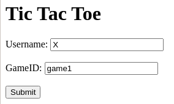
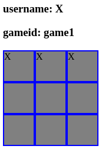

# Tic Tac Toe in Go
	This is a very basic implementation of Tic Tac Toe as a web application.	
	
	
	
## How to run
1. Install Go
2. Build nsqd 
   ```bash
   git clone https://github.com/nsqio/nsq
   cd nsq
   make
   ```
3. Start nsqd and nsqlookupd
   ```bash
   ./build/nsqd --lookupd-tcp-address=127.0.0.1:4160 &
   ./build/nsqlookupd &
   ```
4. Install project dependencies ```cd ../tic-tak && go get```
5. Build project ```go build main.go```
6. Run project ```./main```
7. Open browser to http://localhost:8080

	
